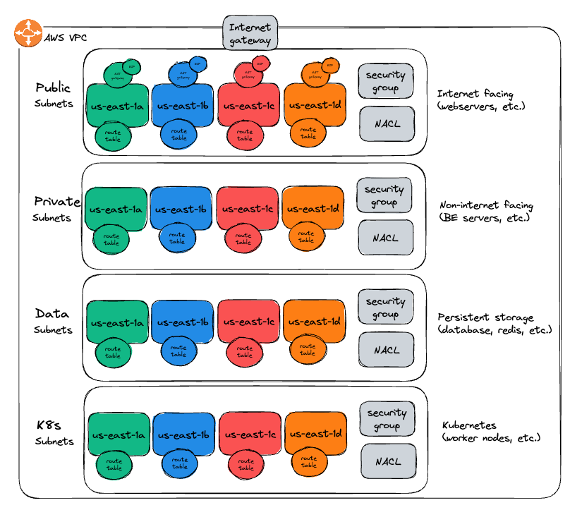

# aws-product-vpc

Terraform module to provision and maintain a Product AWS VPC and it's associated networking resources, including:
* VPC
* Subnets
* Security Groups
* Route Tables
* Network Access Control Lists (NACLs)
* NAT Gateways
* Internet Gateway
* Elastic IPs (EIPs)

## VPC overview
The AWS resources provisioned by this module are illustrated in Figure 1 below. Each architectural layer (public, private, data, and k8s) is distributed across multiple availability zones (shown by color) enabling high availability services to be established.

Figure 1 - Product VPC overview

## Environments
This module can provision and maintain multiple VPC environment instances, across multiple AWS accounts. For example development, staging, and production environments are implemented using multiple Terraform workspaces which maintain individual environment state. While the overall architecture will be consistent across all environments, the value of each variable declared in the variables.tf file is set within a Terraform Cloud workspace. For example the VPC and subnet CIDR addresses will be distinct for each environment.
## Workspaces
Terrform workspaces are used to maintain individual state for each environment. The `backend.tf` file defines remote workspaces named product-vpc-`<workspace>`. The workspace selected is determined by the Git branch to which changes have been applied. For example a change to the Git `release/development` branch will trigger a Terraform Cloud run for the `product-vpc-development` workspace. See [Use VCS-Driven Workflow](https://developer.hashicorp.com/terraform/tutorials/cloud-get-started/cloud-vcs-change) for more information.

Each `workspaces/<workspace>` directory contains a `terraform.tfvars` file containing the non-secret variable values for that workspace/environment. These are for reference only, and can be used to re-populate the non-secret variables defined in the Terraform Cloud workspace.
## Git Branches
Changes to specifc Git branches will trigger Terraform Cloud runs. These triggers are defined within the Terraform Cloud workspace settings. The branches which trigger runs are:
* release/sandbox - triggers a Terraform Cloud run for the product-vpc-sandbox workspace.
* release/development - triggers a Terraform Cloud run for the product-vpc-development workspace.
* release/staging - triggers a Terraform Cloud run for the product-vpc-staging workspace.
* release/production - triggers a Terraform Cloud run for the product-vpc-production workspace.
## Terraform Cloud - The build and release pipeline
When a Terraform Cloud run is triggered it will apply the updated plan according to following workspace configurations:
* `product-vpc-sandbox` - Automatically applied (no approval required)
* `product-vpc-development` - Manual approval
* `product-vpc-staging` - Manual approval
* `product-vpc-production` - Manual approval
## File structure
Files are named according to the Terraform resource they define. For example `aws_subnet.private.tf` defines the private layer subnets.
